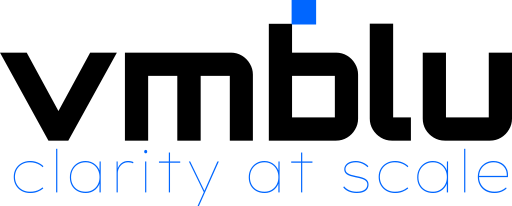

# vmblu examples

This repository contains example applications built with [vmblu](https://github.com/vizualmodel/vmblu). Each example owns its model, source code, assets, and—where applicable—its runnable build.

## Examples

- **Chat application** — separate browser client and Node.js server models.
- **Solar System** — an interactive Three.js simulation with a browser demo.
- **Patient Ledger** — administration, patient client, and server models.
- **CrisisGrid** — a command-centre web application and operational core service.

The canonical gallery inventory is [gallery-manifest.json](./gallery-manifest.json). The vmblu.dev gallery opens these entrypoint files directly from this repository; model copies are not maintained in the website repository.

## Work locally

```bash
git clone https://github.com/vizualmodel/vmblu-examples.git
cd vmblu-examples
npm install
npm run build
```

Individual examples also contain their own README and package scripts.

## Gallery and runnable demos

Validate all published model entrypoints with:

```bash
npm run gallery:validate
```

The Solar System browser build is published by GitHub Actions to:

`https://vizualmodel.github.io/vmblu-examples/solar-system/`

`npm run pages:build` rebuilds the Solar System and stages the Pages artifact in the ignored `_site` directory. To activate deployment, configure this repository's GitHub Pages source as **GitHub Actions**.

## Adding an example

Add the project to its own directory, include a vmblu entrypoint (`*.blu`), and register every gallery model in `gallery-manifest.json`. If it has a static browser demo, add a `demo` entry and teach `scripts/stage-pages.mjs` which artifacts to publish.

## License

The examples are licensed under the [MIT License](./LICENSE.txt). The vmblu repository is licensed under Apache 2.0.
