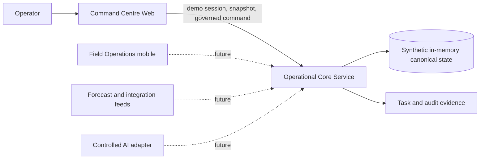

# CrisisGrid

CrisisGrid is an executable-architecture reference for a fictional Antwerp
compound-flood response. This repository intentionally implements one narrow,
governed command-centre journey rather than a complete emergency-management
product.

## Demonstrated system boundary



The browser keeps a disposable projection. Only OCS changes canonical incident
state. The executable OCS is a local reference adapter over the responsibilities
in its vmblu architecture; it is not a production persistence, identity, or
deployment design.

## Run the vertical slice

Use two terminals:

```powershell
cd C:\dev\vmblu-examples\crisis-grid\operational-core-service
npm.cmd install
npm.cmd start
```

```powershell
cd C:\dev\vmblu-examples\crisis-grid\command-centre-web
npm.cmd install
npm.cmd run dev
```

Open the Vite URL, then:

1. Select the amber dashed evacuation assessment zone east of the river.
2. Choose **Send to Action review** in the map context card.
3. Inspect the evidence and decision reason in Action Workspace.
4. Choose **Approve zone**.
5. Observe the canonical projection change from `ocs-1` to `ocs-2`, the zone's
   approved state, the assigned field-preparation task, and its attributable
   audit evidence in Situation Dashboard.

Restart OCS to reset the deterministic exercise state.

## Governed action sequence

```mermaid
sequenceDiagram
  participant S as Spatial Workspace
  participant A as Action Workspace
  participant C as Operational Core Connection
  participant O as Operational Core Service
  participant P as Operational Picture

  S->>A: Queue non-authoritative evacuation proposal
  A->>A: Human reviews evidence and reason
  A->>C: Submit stable operation ID and expected version
  C->>O: Authenticated governed command
  O->>O: Check policy shape, version, and idempotency; commit audit and task
  O-->>A: committed / rejected / conflict / unavailable / uncertain
  A->>P: Command committed
  P->>C: Reload canonical incident picture
  C->>O: Authorized snapshot request
  O-->>P: Versioned canonical projection
  P-->>S: Shared projection update
```

## Capability status

| Capability | Status | Deliberate boundary |
|---|---|---|
| Shared operational map and situation projection | Implemented | Synthetic Antwerp scenario |
| Spatial selection and evacuation proposal | Implemented | One proposed zone |
| Human review and governed submission | Implemented | One command type and demo operator |
| Canonical version, idempotency, task, and audit evidence | Implemented | In-memory OCS state |
| Session and HTTP application boundary | Implemented | Local demo token, not production authentication |
| Operational domain, resources, geospatial, repository responsibilities | Modelled | vmblu OCS architecture |
| Live delivery, reconnect, and offline cache | Future | Explicitly unavailable |
| Persistent database and transactional outbox | Future | Architecture decision remains open |
| Talk, public warning delivery, mobile field operations, controlled AI | Future | No implied operational capability |

## Verification

```powershell
cd operational-core-service
npm.cmd test
npm.cmd run build
npx.cmd vmblu verify operational-core-service.blu

cd ..\command-centre-web
npm.cmd run build
npx.cmd vmblu verify command-centre-web.blu
```

The primary design inputs remain in [docs](./docs/), especially
`architecture-principles.md`, `conceptual-architecture-flows.md`, and
`ccw-operator-scenarios.md`.
